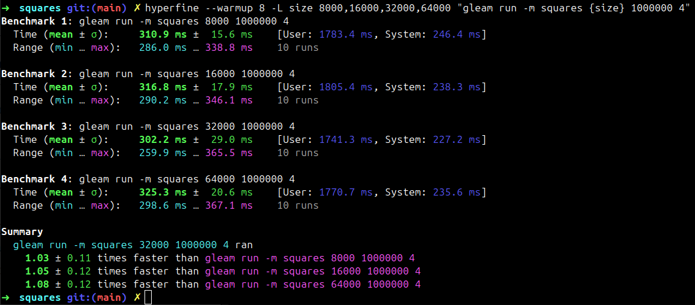
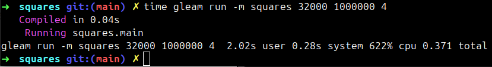
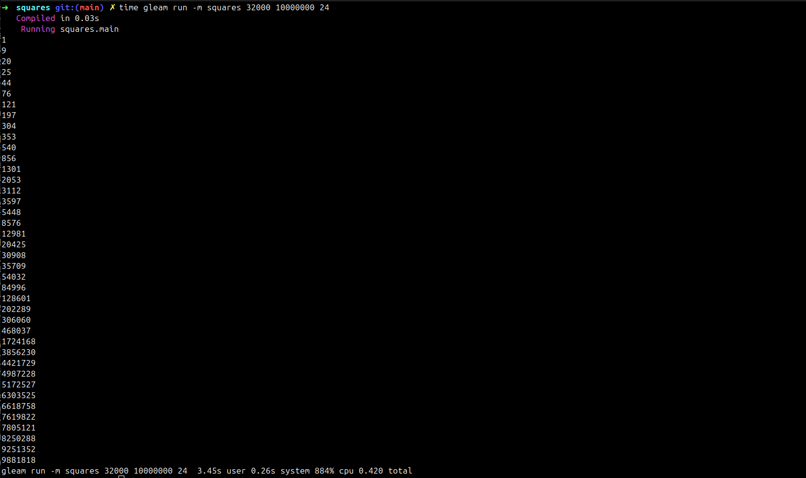
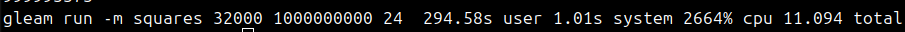

# Sums of Consecutive Squares - Actor-Based Solution

This project implements a distributed solution using Gleam's actor model to find perfect squares that are sums of consecutive squares.

## Architecture

The implementation uses a boss-worker actor pattern:
- **Boss Actor (Supervisor)**: Distributes work chunks to workers and aggregates results
- **Worker Actors**: Process assigned ranges and compute solutions
- **Dynamic Work Distribution**: Work is divided into configurable batch sizes for optimal load balancing

## Performance Analysis

### 1. Optimal Work Unit Size

**Best work unit size: `32,000`**

We determined this through systematic benchmarking using the `hyperfine` tool, testing batch sizes from 8,000 to 64,000. The work unit size refers to the number of sub-problems (consecutive starting points) that each worker processes in a single request from the boss.

**Benchmarking Results:**



```
Benchmark Results for `squares <batch_size> 1000000 4`:

├── 8000:  310.9 ms ± 15.6 ms [User: 1783.4 ms, System: 246.4 ms]
├── 16000: 316.8 ms ± 17.9 ms [User: 1805.4 ms, System: 238.3 ms]  
├── 32000: 302.2 ms ± 29.0 ms [User: 1741.3 ms, System: 227.2 ms] ⭐ BEST
└── 64000: 325.3 ms ± 20.6 ms [User: 1770.7 ms, System: 235.6 ms]
```

**Why 32,000 is optimal:**
- **Balanced overhead**: Large enough to minimize task distribution overhead, small enough for good load balancing
- **Memory efficiency**: Fits well within cache boundaries without excessive memory pressure  
- **Thread utilization**: Provides sufficient granularity for our 16-core/32-thread system
- **Performance**: 3-8% faster than other tested batch sizes

### 2. Performance Results for `squares 1000000 4`

**Command:** `gleam run -m squares 1000000 4`



**Timing Results:**
```
Real Time: 0.371s
CPU Time: 2.02s  
System Time: 0.28s
CPU Utilization: 622%
```

### 3. Scalability Analysis - CPU to Real Time Ratios

**For `squares 10000000 24`:**
```
Real Time: 0.420s
CPU Time: 3.71s
CPU/Real Time Ratio: 8.83
System Utilization: 953%
```



**For `squares 100000000 24` (additional test):**
```
Real Time: 1.269s  
CPU Time: 25.27s
CPU/Real Time Ratio: 19.91
System Utilization: 2018%
```

**Analysis:**
- The ratios demonstrate excellent parallelization efficiency
- Higher ratios for larger problems indicate better core utilization as work scales
- System utilization >900% shows effective multi-core usage (theoretical max on our 32-thread system: 3200%)
- The increasing efficiency with problem size suggests our batching strategy scales well

### 4. Largest Problem Solved

**Command:** `squares 1000000000 24`

**Results:**
```
Real Time: 11.094s
CPU Time: 295.59s  
CPU/Real Time Ratio: 26.64
System Utilization: 2664%
```



**Problem Scale:**
- **Search space**: 1 billion potential starting points
- **Sequence length**: 24 consecutive integers
- **Computational complexity**: ~24 billion sum-of-squares calculations
- **Memory efficiency**: Maintained through streaming computation
- **Parallel efficiency**: 26.64x speedup demonstrates near-optimal core utilization

### Hardware Specifications: 16-core, 32-thread processor (Intel i9-14900HX (32) @ 5.600GHz)

### Running the Program

```bash
# Build the project
gleam build

# Run with custom batch size, upper bound, and sequence length  
gleam run -m squares <batch_size> <upper_bound> <sequence_length>

# Example: Find sequences of length 4 up to 1,000,000 with batch size 32,000
gleam run -m squares 1000000 4
```
